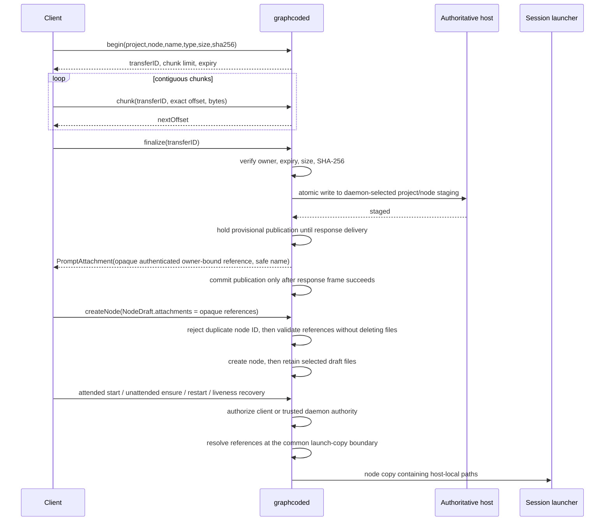

# Remote asset ownership and transfer contract

Remote assets use daemon protocol v2 correlated requests. The daemon is the authorization
boundary and chooses every destination. Clients provide a project identity, node identity,
safe display name, media type, byte count, digest, and ordered bytes; they never provide a
host destination path.

## Ownership

| Project classification | Authoritative template host                                                             | Attachment staging host                                             |
| ---------------------- | --------------------------------------------------------------------------------------- | ------------------------------------------------------------------- |
| Local                  | daemon host: project `.graphcode/templates` plus daemon user's template library         | daemon host: node memory attachment directory                       |
| SSH                    | SSH project host: project `.graphcode/templates` plus that host user's template library | SSH project host: `~/.graphcode/staging/<project-digest>/<node-id>` |
| Codespace              | Codespace project host, reached through the existing `gh codespace ssh` transport       | Codespace host, with the same staging layout as SSH                 |

`ProjectRef.metadata` is authoritative. Missing metadata or a false `templates` /
`attachments` capability fails closed. Local-looking strings do not change ownership:
classification, joined-project authorization, the canonical project identity, and the node
identity all have to agree. The authenticated project identity hashes both the
authoritative location kind and canonical path, so identical-looking local, SSH, and
Codespace paths remain distinct.

## Template list and read

```mermaid
sequenceDiagram
  participant C as Client
  participant D as graphcoded
  participant H as Authoritative host
  C->>D: v2 openProject(project)
  C->>D: listTemplates(project, maxCount, maxBytes)
  D->>D: verify joined project + authoritative capability
  D->>H: bounded list/read regular *.md files
  H-->>D: safe names + bounded UTF-8 documents
  D->>D: reject duplicate UUIDs; sign origin + name + content digest
  D-->>C: correlated templateList (metadata + authenticated asset ID)
  C->>D: readTemplate(project, UUID, authenticated asset ID, maxBytes)
  D->>H: repeat bounded authoritative read and verify the exact identity
  D-->>C: correlated normalized templateContent
```

Hidden entries, non-markdown files, symlinks, non-regular files, hard-linked remote files,
oversized files, invalid UTF-8, malformed templates, unsafe names, and entries beyond the
request limits are rejected or omitted. Local and remote files are opened without
following links and validated from the opened handle before bounded reads. Remote process
stdout and stderr are drained concurrently with hard byte ceilings. Template contents are never replayed, broadcast,
logged, journaled, or copied into graph snapshots.

The daemon-issued template asset ID binds the authoritative project identity, template
UUID, project/home origin, safe filename, and content digest. Reads without that identity
fail closed. Duplicate UUIDs are rejected independent of list order, and a file that
changes or moves between project and home scope after listing cannot satisfy the read.

## Attachment upload and launch



The maximum file size remains 10 MiB, the maximum attachment count is 10, and the raw
chunk maximum is 256 KiB. A maximum chunk encoded inside a complete v2 request envelope is
below the 1 MiB frame limit. Offsets must be exact and monotonic; overlap, gaps, replay,
unknown IDs, cross-client transfer use, hash mismatch, expiry, disconnect, cancellation,
and oversized chunks fail. Finalization uses a temporary regular file followed by
atomic no-clobber publication. Existing destinations are never followed or overwritten.

Aggregate reservations prevent many-node exhaustion in addition to the per-file and
per-node limits:

| Scope                 | Active transfers | Declared bytes | Buffered bytes |
| --------------------- | ---------------- | -------------- | -------------- |
| Connection/owner      | 32               | 64 MiB         | 32 MiB         |
| Authoritative project | 128              | 256 MiB        | 128 MiB        |
| Daemon                | 256              | 512 MiB        | 256 MiB        |

Count and declared-byte reservations are atomic at begin; buffered bytes are reserved
before each append. Every terminal path releases the same accounting without wrapping
integer addition.

The graph persists only the authenticated opaque reference and safe display name.
Attachment bytes never enter graph JSON, event replay, ordinary broadcasts, recents,
errors, journals, or dial logs. Attended starts, unattended starts, restart recovery, and
remote liveness ensures all resolve a launch-only node copy at one daemon boundary.
Persisted references are never replaced with host paths. A requesting connection must
already be joined to the canonical project before node lookup; internal recovery uses a
separate trusted daemon authority.

Finalize transitions atomically out of receiving before host staging begins. Cancel and
disconnect wait for an in-flight host operation, request transport cancellation where
supported, and remove any destination published before reference delivery. A failed
response write rolls publication back. Cleanup is retried and remains explicitly pending
if retries are exhausted; cancellation never reports success while a later finalize can
publish.

Create rejects an existing node ID before any file operation. Reference validation is
non-destructive, and unselected draft files are removed only after successful node
creation. Failure cleanup is owner-bound to draft files and cannot delete an existing
node directory. Created-node files remain until normal node-memory cleanup removes them.

## Compatibility

The contract is additive v2 and advertised by the `remoteAssets` server capability.
Unknown command/event fields retain normal Codable forward-compatibility behavior. V2
clients must use opaque attachment references and authenticated template asset IDs. The
narrow v1 local compatibility form accepts only a regular, single-link, non-reparse file
whose exact safe filename is already inside the authoritative project/node attachment
directory; containment and file type are checked again at launch. Arbitrary daemon-host
paths, traversal, remote legacy paths, and links are rejected before graph mutation. New
macOS clients fall back to the legacy local template implementation when an older daemon
does not advertise v2 remote assets; remote access fails closed rather than reading a
client-local URI.
