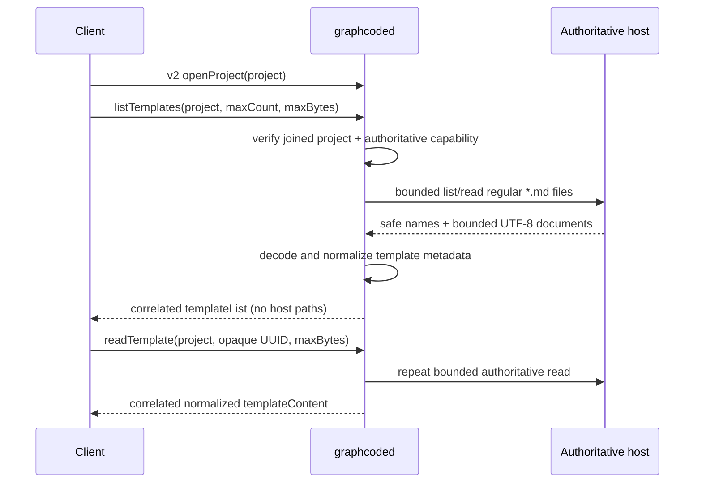
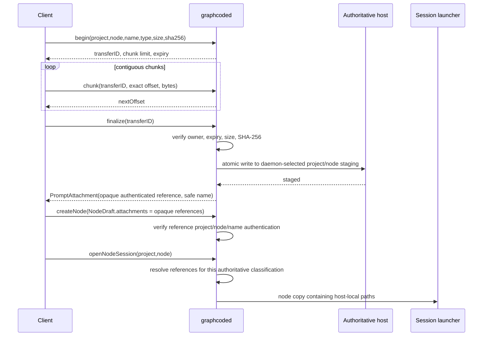

# Remote asset ownership and transfer contract

Remote assets use daemon protocol v2 correlated requests. The daemon is the authorization
boundary and chooses every destination. Clients provide a project identity, node identity,
safe display name, media type, byte count, digest, and ordered bytes; they never provide a
host destination path.

## Ownership

| Project classification | Authoritative template host                                                             | Attachment staging host                                             |
| ---------------------- | --------------------------------------------------------------------------------------- | ------------------------------------------------------------------- |
| Local                  | daemon host: project `.graphcode/templates` plus daemon user's template library         | daemon host: node memory attachment directory                       |
| SSH                    | SSH project host: project `.graphcode/templates` plus that host user's template library | SSH project host: `~/.graphcode/staging/<project-digest>/<node-id>` |
| Codespace              | Codespace project host, reached through the existing `gh codespace ssh` transport       | Codespace host, with the same staging layout as SSH                 |

`ProjectRef.metadata` is authoritative. Missing metadata or a false `templates` /
`attachments` capability fails closed. Local-looking strings do not change ownership:
classification, joined-project authorization, the canonical project identity, and the node
identity all have to agree. The authenticated project identity hashes both the
authoritative location kind and canonical path, so identical-looking local, SSH, and
Codespace paths remain distinct.

## Template list and read

Hidden entries, non-markdown files, symlinks, non-regular files, hard-linked remote files,
oversized files, invalid UTF-8, malformed templates, unsafe names, and entries beyond the
request limits are rejected or omitted. Local and remote files are opened without
following links and validated from the opened handle before bounded reads. Remote process
stdout and stderr are drained concurrently with hard byte ceilings. Template contents are never replayed, broadcast,
logged, journaled, or copied into graph snapshots.

## Attachment upload and launch

The maximum file size remains 10 MiB, the maximum attachment count is 10, and the raw
chunk maximum is 256 KiB. A maximum chunk encoded inside a complete v2 request envelope is
below the 1 MiB frame limit. Offsets must be exact and monotonic; overlap, gaps, replay,
unknown IDs, cross-client transfer use, hash mismatch, expiry, disconnect, cancellation,
and oversized chunks fail. Finalization uses a temporary regular file followed by
atomic no-clobber publication. Existing destinations are never followed or overwritten.

The graph persists only the authenticated opaque reference and safe display name.
Attachment bytes never enter graph JSON, event replay, ordinary broadcasts, recents,
errors, journals, or dial logs. The launcher resolves a copy of the node, so host paths
are not written back to the graph. Before node creation, the daemon removes staged files
whose references were removed from the draft; a discard request is refused for an
existing graph node. Transfer buffers are removed after finalize, cancel,
expiry, hash failure, transport failure, or disconnect. Finalized files become node-owned:
cancelled drafts remove the node staging directory; created nodes retain files until normal
node-memory cleanup removes that directory after node deletion.

## Compatibility

The contract is additive v2 and advertised by the `remoteAssets` server capability.
Unknown command/event fields retain normal Codable forward-compatibility behavior. Old
clients keep their existing local-path behavior against new daemons only for local
projects. Remote projects reject legacy path attachments. New macOS clients fall back to
the legacy local template implementation when an older daemon does not advertise v2
remote assets; remote access fails closed rather than reading a client-local URI.
